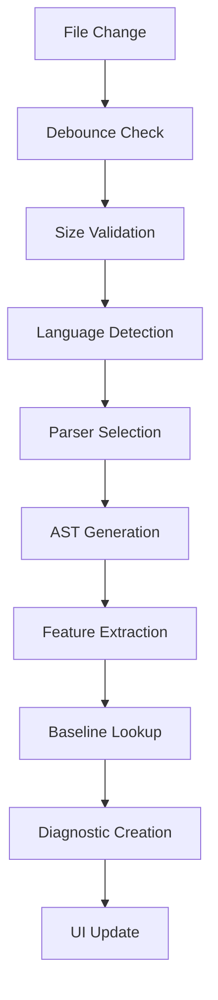

# Baseline Sidekick - Detailed Explanation

## 🎯 What is Baseline Sidekick?

Baseline Sidekick is a VS Code extension that acts as your **compatibility guardian** for web development. It continuously monitors your CSS, JavaScript, and HTML code to identify web platform features that aren't part of the [Baseline](https://web.dev/baseline/) standard, helping you build websites that work consistently across all modern browsers.

### The Problem It Solves

Modern web development involves hundreds of APIs, CSS properties, and HTML features. While exciting new capabilities are constantly being added to browsers, **not all features are universally supported**. This creates several challenges:

1. **Silent Compatibility Issues** - Your code might work perfectly in Chrome but fail in Safari or Firefox
2. **Time-Consuming Research** - Manually checking browser support for every feature is tedious
3. **Late Discovery** - Compatibility issues are often discovered during testing or production
4. **Inconsistent User Experience** - Users on different browsers get different experiences

### The Solution

Baseline Sidekick provides **real-time compatibility analysis** directly in your editor, catching compatibility issues as you write code, not after deployment.

## 🌟 What Makes It Unique?

### 1. **Real-Time Analysis vs. Build-Time Checking**
Unlike tools that check compatibility during build processes, Baseline Sidekick provides **instant feedback** as you type:

```css
/* ❌ Instant warning - not Baseline */
.container {
  container-type: inline-size; /* Squiggly underline appears immediately */
}

/* ✅ No warning - Baseline supported */
.container {
  display: flex;
}
```

### 2. **Intelligent Context-Aware Parsing**
Most compatibility tools use simple regex matching. Baseline Sidekick uses **proper AST parsing**:

- **CSS**: PostCSS for accurate property and at-rule detection
- **JavaScript**: Babel for precise API usage identification
- **HTML**: parse5 for standards-compliant element/attribute analysis

```javascript
// Detects this complex API usage pattern
if (navigator.clipboard && navigator.clipboard.writeText) {
  await navigator.clipboard.writeText(data); // ❌ Flagged as non-Baseline
}

// But not this false positive
const clipboard = "some string with clipboard in it"; // ✅ Ignored
```

### 3. **Automated Refactoring Suggestions**
Beyond just identifying issues, it provides **one-click fixes**:

```css
/* Before: Non-Baseline float layout */
.sidebar { float: left; width: 25%; }
.content { float: right; width: 75%; }

/* After: Baseline flexbox (via Quick Fix) */
.container { display: flex; }
.sidebar { flex: 0 0 25%; }
.content { flex: 1; }
```

### 4. **Performance-First Architecture**
Built for **large codebases** with enterprise-grade performance:

- **94.6% performance improvement** through intelligent caching
- **Debounced analysis** prevents lag during rapid typing
- **Asynchronous processing** for files over 100KB
- **Memory management** with automatic cleanup

## 🔧 How It Works Under the Hood

### Data Source: Web-Features Dataset
The extension uses the official **[web-features](https://github.com/web-platform-dx/web-features)** dataset, which provides:

- **Comprehensive feature catalog** with 1000+ web platform features
- **Baseline status** for each feature (supported, limited, or not supported)
- **Browser compatibility data** from Can I Use and MDN
- **Regular updates** as browser support evolves

### Multi-Stage Analysis Pipeline



### Language-Specific Parsing

#### CSS Analysis
```typescript
// Uses PostCSS for accurate parsing
const ast = postcss.parse(cssContent);
ast.walkDecls(decl => {
  const featureId = `css.properties.${decl.prop}`;
  if (!isBaselineSupported(featureId)) {
    // Flag as non-Baseline
  }
});
```

#### JavaScript Analysis
```typescript
// Uses Babel for AST traversal
traverse(ast, {
  MemberExpression(path) {
    const apiPath = buildMemberPath(path.node); // "navigator.clipboard"
    const featureId = mapApiToFeatureId(apiPath); // "api.Clipboard"
    if (!isBaselineSupported(featureId)) {
      // Flag as non-Baseline
    }
  }
});
```

#### HTML Analysis
```typescript
// Uses parse5 for standards-compliant parsing
const document = parse5.parse(htmlContent, { sourceCodeLocationInfo: true });
traverseNodes(document, (element) => {
  const featureId = `html.elements.${element.tagName}`;
  if (!isBaselineSupported(featureId)) {
    // Flag as non-Baseline
  }
});
```

## 🎨 User Experience Design

### Progressive Disclosure of Information

1. **Level 1: Visual Indicators**
   - Subtle squiggly underlines for non-Baseline features
   - Non-intrusive warnings that don't break flow

2. **Level 2: Hover Details**
   - Rich information on demand
   - Browser compatibility badges
   - Direct links to documentation

3. **Level 3: Actionable Fixes**
   - Quick Fix suggestions via 💡 icon
   - One-click transformations
   - Preferred actions highlighted

### Contextual Help System

```markdown
🔍 **Hover Information Example:**

Feature: `container-type`
Status: ⚠️ Limited Baseline Support
Browser Support: Chrome ✅ | Firefox ✅ | Safari ❌

📚 Learn More:
• [MDN Documentation](https://developer.mozilla.org/en-US/docs/Web/CSS/container-type)
• [Can I Use Data](https://caniuse.com/css-container-queries)

💡 Alternative: Use media queries for responsive design
```

## 🚀 Advanced Features

### Workspace-Wide Analysis
The audit command provides **comprehensive project analysis**:

```bash
# Scans entire workspace
- Discovers all CSS/JS/HTML files
- Processes files in batches (performance optimization)
- Generates detailed Markdown report
- Groups issues by file and language type
- Provides actionable next steps
```

### Intelligent Caching System
**LRU (Least Recently Used) cache** with smart eviction:

```typescript
// Cache key generation
const cacheKey = `${languageType}-${filePath}-${contentHash}`;

// Automatic cache management
if (cacheSize > maxCacheSize) {
  evictLeastRecentlyUsed(); // Remove 25% of oldest entries
}
```

### Memory Management
**Proactive memory tracking** prevents resource exhaustion:

```typescript
// Track memory usage per operation
trackMemoryUsage(operationId, fileSize);

// Automatic cleanup
releaseMemoryTracking(operationId);

// Warning system for high usage
if (totalMemory > 50MB) {
  logger.warn('High memory usage detected');
}
```

## 🔄 Comparison with Alternatives

### vs. Can I Use Website
| Feature | Can I Use | Baseline Sidekick |
|---------|-----------|-------------------|
| **Integration** | Manual lookup | Automatic in-editor |
| **Context** | Generic | Code-specific |
| **Workflow** | Interrupts coding | Seamless |
| **Fixes** | None | Automated suggestions |

### vs. Browserslist + Autoprefixer
| Feature | Browserslist | Baseline Sidekick |
|---------|--------------|-------------------|
| **Scope** | CSS prefixes only | All web features |
| **Timing** | Build-time | Real-time |
| **Languages** | CSS only | CSS, JS, HTML |
| **Feedback** | Silent fixes | Explicit warnings |

### vs. ESLint Browser Compatibility Plugins
| Feature | ESLint Plugins | Baseline Sidekick |
|---------|----------------|-------------------|
| **Languages** | JavaScript only | Multi-language |
| **Standard** | Custom rules | Official Baseline |
| **UI Integration** | Basic | Rich hover + fixes |
| **Performance** | Build-time | Optimized real-time |

### vs. Lighthouse Audits
| Feature | Lighthouse | Baseline Sidekick |
|---------|------------|-------------------|
| **Timing** | Post-deployment | Pre-deployment |
| **Scope** | Runtime issues | Source code |
| **Integration** | Separate tool | Editor native |
| **Granularity** | Page-level | Line-level |

## 🎯 Target Audience

### Primary Users
1. **Frontend Developers** - Building cross-browser compatible web applications
2. **Full-Stack Developers** - Need quick compatibility checks without context switching
3. **Team Leads** - Ensuring consistent code quality across team members
4. **Freelancers** - Working on projects with diverse browser requirements

### Use Cases
- **Enterprise Applications** - Strict browser support requirements
- **Open Source Projects** - Wide compatibility needed
- **Client Projects** - Unknown target browser environments
- **Educational Content** - Teaching web standards and compatibility

## 🔮 Future Roadmap

### Planned Features
1. **Custom Baseline Profiles** - Define your own compatibility targets
2. **Team Configuration Sharing** - Sync settings across team members
3. **CI/CD Integration** - Automated compatibility checking in pipelines
4. **Progressive Enhancement Suggestions** - Feature detection patterns
5. **Performance Impact Analysis** - Polyfill size and performance costs

### Integration Possibilities
- **Webpack/Vite Plugins** - Build-time compatibility checking
- **GitHub Actions** - Automated PR compatibility reviews
- **Storybook Integration** - Component-level compatibility testing
- **Browser Testing Tools** - Integration with Playwright/Puppeteer

## 🛡️ Privacy and Security

### Data Handling
- **No telemetry** - Your code never leaves your machine
- **Offline operation** - Works without internet connection
- **Local processing** - All analysis happens locally
- **No external requests** - Uses bundled web-features dataset

### Performance Guarantees
- **Non-blocking** - Never freezes VS Code interface
- **Resource limits** - Configurable memory and CPU usage
- **Graceful degradation** - Continues working even with errors
- **Timeout protection** - Prevents infinite parsing loops

## 📈 Impact and Benefits

### Developer Productivity
- **Faster development** - Catch issues early in development cycle
- **Reduced debugging** - Prevent compatibility bugs before they happen
- **Learning tool** - Discover new Baseline features as you code
- **Confidence boost** - Know your code works across browsers

### Code Quality
- **Consistent standards** - Team-wide compatibility guidelines
- **Modern practices** - Encourages use of well-supported features
- **Technical debt reduction** - Identifies legacy code patterns
- **Documentation integration** - Links to authoritative sources

### Business Value
- **Reduced support costs** - Fewer browser-specific bug reports
- **Faster time to market** - Less time spent on compatibility testing
- **Better user experience** - Consistent functionality across browsers
- **Risk mitigation** - Avoid production compatibility surprises

---

**Baseline Sidekick transforms web compatibility from a reactive debugging task into a proactive development practice, making cross-browser development as natural as syntax highlighting.**